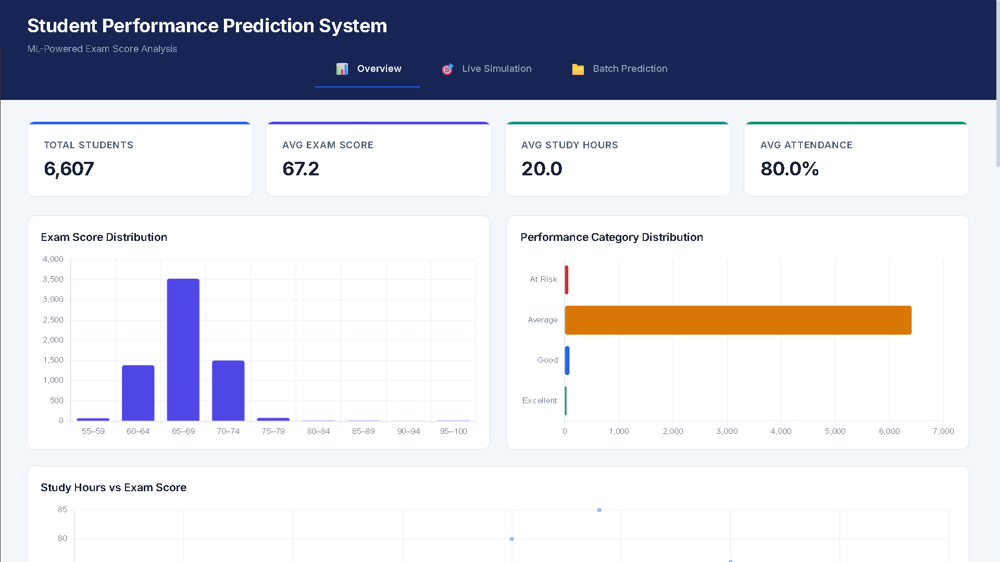

<div align="center">

### **Student Performance Prediction System**

**AI-Powered Exam Score Prediction with Interactive Dashboard & Model Signals**

[](LICENSE)
[]()
[]()
[]()
[]()
[]()
[]()
[]()
[]()
[]()
[]()

---

**Student Performance Prediction System** is a portfolio-grade ML platform that predicts continuous exam scores using supervised regression on the Kaggle Student Performance Factors dataset (6,607 students).
It achieves **R² = 0.6888** on the held-out test set (27/27 tests passing) while operating as a **serverless GitHub Pages deployment** with **zero-cost static hosting**.

[**Live Dashboard**](https://girishshenoy16.github.io/student-performance-prediction) | [**Project Report**](PROJECT_REPORT.md)

</div>

---

## Live Demo

<div align="center">

[](https://girishshenoy16.github.io/student-performance-prediction)

ML-powered exam score prediction with a **Power BI-inspired** 3-tab dashboard. 100% static deployment on GitHub Pages.
</div>

---

## 1. Business Problem

Educational institutions need data-driven tools to identify at-risk students early and allocate support resources effectively. 

This system predicts continuous exam scores from 19 student factors, enabling proactive intervention rather than reactive grading.

## 2. Dataset

**Student Performance Factors** (Kaggle) — 6,607 students, 20 columns: 6 numeric predictor features, 13 categorical predictor features, and 1 numeric target (Exam_Score).

| Metric         | Value                                                                                 |
|----------------|---------------------------------------------------------------------------------------|
| Rows           | 6,607                                                                                 |
| Features       | 19 (6 numeric, 13 categorical)                                                        |
| Target         | `Exam_Score` (range 55–101, mean 67.24, std 3.89)                                     |
| Missing Values | 3 columns (Teacher_Quality: 78, Parental_Education_Level: 90, Distance_from_Home: 67) |
| Duplicates     | 0                                                                                     |


## 3. Model Results

| Model                 | MAE        | RMSE       | R²         |
|-----------------------|------------|------------|------------|
| **Linear Regression** | **1.0165** | **2.0972** | **0.6888** |
| Random Forest         | 1.1613     | 2.2690     | 0.6358     |
| XGBoost               | 0.9654     | 2.1874     | 0.6615     |

**Winner:** Linear Regression — highest R², full JS-reproducibility, transparent coefficients.


### Top Predictive Signals

| Rank | Feature                | Importance |
|------|------------------------|------------|
| 1    | Engagement Score       | 4.078      |
| 2    | Study Efficiency Index | 2.347      |
| 3    | Attendance             | 2.285      |
| 4    | Hours Studied          | 1.710      |
| 5    | Internet Access        | 0.971      |


### Key Correlations


## 4. Dashboard

| Tab                  | Features                                                                                                  |
|----------------------|-----------------------------------------------------------------------------------------------------------|
| **Overview**         | 4 KPI cards, score distribution, scatter plots, feature importance, model comparison, top signals, benchmark table, data-driven insights |
| **Live Simulation**  | 19-field form, real-time prediction, repeated predictions without reset, dynamic recommendations          |
| **Batch Prediction** | CSV drag-and-drop, column validation, 4-step workflow tracker, batch inference, CSV download              |

## 5. Architecture

```
data/raw/StudentPerformanceFactors.csv
    ↓
Data Validation (src/data_validation.py)
    ↓
Preprocessing & Feature Engineering (src/preprocessing.py, src/feature_engineering.py)
    ↓
Model Benchmark: Linear Reg. vs Random Forest vs XGBoost (src/train_model.py)
    ↓
Evaluation & Selection: MAE / RMSE / R² (src/evaluate.py)
    ↓
Artifact Export → docs/artifacts.json (src/export_artifacts.py)
    ↓
Python ↔ JS Cross-Runtime Verification (60 records, tolerance ≤ 0.01)
    ↓
Power BI-Inspired 3-Tab Frontend (docs/)
    ↓
Static GitHub Pages Deployment
```

## 6. Data-Driven Insights

| Insight                           | Value                                          |
|-----------------------------------|------------------------------------------------|
| Attendance–Score Correlation      | +0.581                                         |
| Study Hours–Score Correlation     | +0.445                                         |
| Previous Scores–Score Correlation | +0.175                                         |
| Largest Segment                   | Average — 6,415 students (97.1%)               |
| Strongest Model Signal            | Engagement Score (24.0% normalized importance) |


## 7. Testing & Quality

| Module                      | Tests  | Status        |
|-----------------------------|--------|---------------|
| test_data_validation.py     | 9      | ✅            |
| test_preprocessing.py       | 5      | ✅            |
| test_feature_engineering.py | 6      | ✅            |
| test_model_export.py        | 3      | ✅            |
| test_batch_prediction.py    | 4      | ✅            |
| **Total**                   | **27** | **100% pass** |

- Cross-runtime: 60 records verified between Python and JavaScript (tolerance ≤ 0.01)
- All JS files pass syntax validation; CSS braces balanced

## 8. Quick Start

```bash
# Clone the repository
git clone https://github.com/girishshenoy16/student-performance-prediction.git
cd student-performance-prediction

# Create and activate virtual environment
python -m venv venv
venv\Scripts\activate          # Windows
source venv/bin/activate       # Linux/Mac

# Install dependencies
pip install --upgrade pip
pip install -r requirements.txt

# Run complete pipeline
python main.py

# Start dashboard server
python -m http.server 8000 --directory docs

# Open http://localhost:8000

# Run tests
pytest tests/ -v
```

## Folder Structure

```
Student Performance Prediction System/
├── data/
│   ├── raw/                             
│   └── processed/                  
├── src/                                  
│   ├── data_validation.py
│   ├── preprocessing.py
│   ├── feature_engineering.py
│   ├── train_model.py
│   ├── evaluate.py
│   └── export_artifacts.py
├── tests/                               
│   ├── test_data_validation.py
│   ├── test_preprocessing.py
│   ├── test_feature_engineering.py
│   ├── test_model_export.py
│   └── test_batch_prediction.py
├── docs/                                 
│   ├── index.html                
│   ├── artifacts.json             
│   ├── overview_data.json             
│   ├── css/style.css                   
│   ├── assets/
│   │   └── overview.png
│   └── js/
│       ├── predictor.js                
│       ├── app.js                      
│       ├── overview.js                 
│       └── csv_handler.js            
├── outputs/
│   ├── exam_score_distribution.png
│   ├── performance_categories.png
│   ├── model_comparison.png
│   ├── feature_importance.png
│   ├── top_signals.png
│   ├── study_hours_vs_score.png
│   ├── attendance_vs_score.png
│   └── dataset_overview.png
├── main.py                              
├── requirements.txt
├── generate_plots.py
├── README.md
└── PROJECT_REPORT.md
```

## 9. Tech Stack

| Layer      | Technologies                                                     |
|------------|------------------------------------------------------------------|
| ML         | scikit-learn, XGBoost, pandas, NumPy                             |
| Frontend   | HTML5, CSS3 (Inter font, dark theme), Vanilla JS, Chart.js 4.4.0 |
| Testing    | pytest (27 tests), Node.js (cross-runtime verification)          |
| Deployment | GitHub Pages (100% static)                                       |


## 10. Limitations & Future Scope

**Limitations:**
- Linear Regression assumes linear feature relationships
- R² = 0.6888 — moderate explanatory power; 31.1% of variance unexplained
- No real-time data pipeline or database integration
- No hyperparameter optimization applied

**Future Scope:**
- Hyperparameter tuning (GridSearchCV/Optuna)
- Ensemble stacking for potential R² improvement
- SHAP-based explainability layer
- Streamlit/Flask dashboard variant for dynamic deployment
- Longitudinal tracking across semesters

---

## Contact

<div align="center">

**Girish Shenoy**

[](https://github.com/girishshenoy16)
[](https://linkedin.com/in/girishshenoys)
[](mailto:girishpshenoy09@gmail.com)

</div>

---

## License

This project is licensed under the MIT License — see the [LICENSE](LICENSE) file for details.

---

## Acknowledgements

| Resource                                                                                                         | Description                            |
|------------------------------------------------------------------------------------------------------------------|----------------------------------------|
| [Kaggle Student Performance Factors Dataset](https://www.kaggle.com/datasets/lainguyn/studentperformancefactors) | Student academic performance benchmark |
| [Scikit-learn](https://scikit-learn.org/)                                                                        | Machine learning in Python             |
| [XGBoost](https://xgboost.readthedocs.io/)                                                                       | Gradient boosting library              |
| [Chart.js](https://www.chartjs.org/)                                                                             | JavaScript charting library            |

---

<div align="center">

**Built with precision. Designed for education analytics. Documented for real-world decision support.**

Student Performance Prediction System v1.0 — Portfolio-Grade Student Performance Prediction & Decision Support System

</div>
